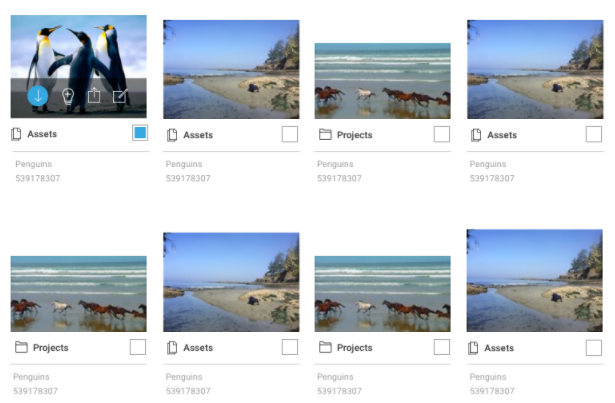

# Markup task

Make HTML/CSS for this mockup.

## Task

1. Number of items in a row must depends on window size. You can specify max and min width for grid.
2. You can see hover effect on elem on first item in top line (Transparent black line in the bottom of image with action icons).
This 4 icons are buttons. Hover effect on one button you can see on the left one (blue circle background).
3. Icons here are for example only. You can use another vector icons from [flaticon.com](http://flaticon.com).
4. Square under the image is custom checkbox elem. In the first item of grid you can see checked checkbox view.
5. Images can be different width and height, so you can resize them.

## Comments

1. You can use preprocessors or write pure css.
2. You can yuse build scripts (gulp, grunt) to builda your css (it isn't important in this task).
3. Better to put solved task on github and send us 2 links on source code and on deployed markup to github pages.
Or you can use [codepen.io](http://codepen.io).

## Good Luck!
